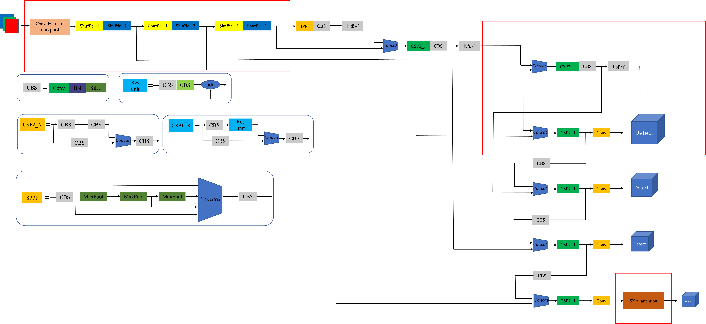
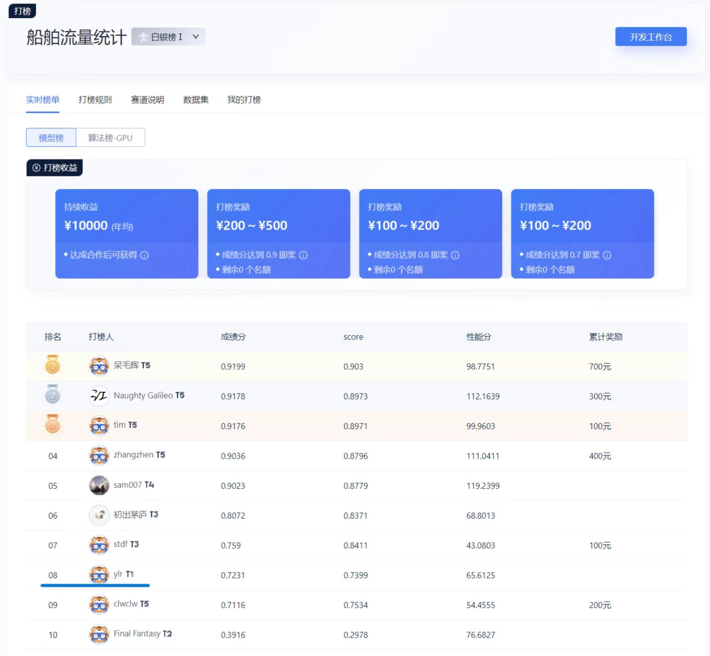
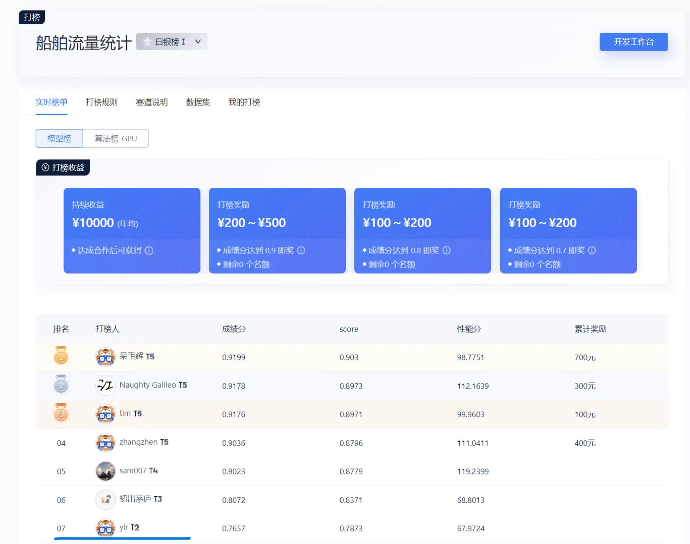
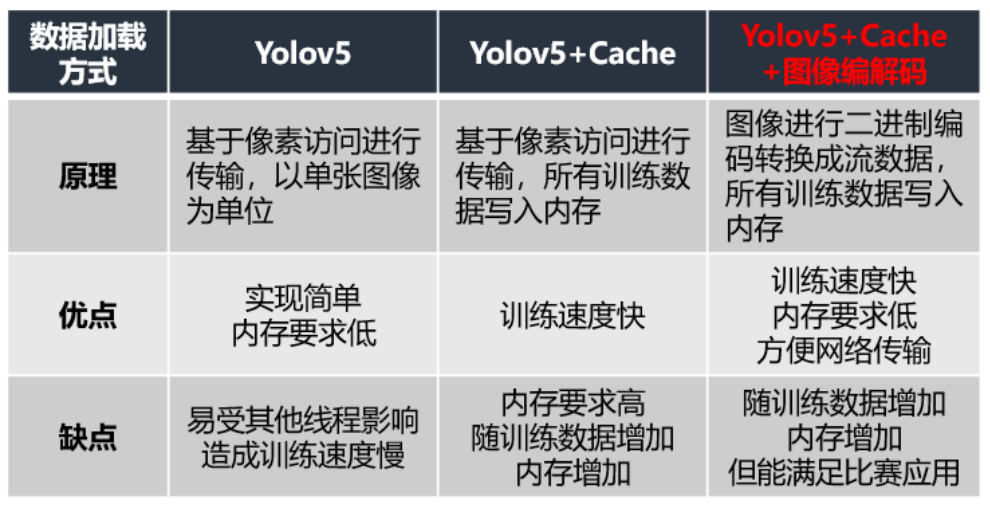
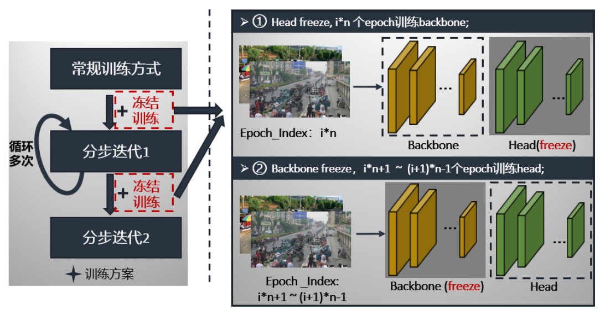
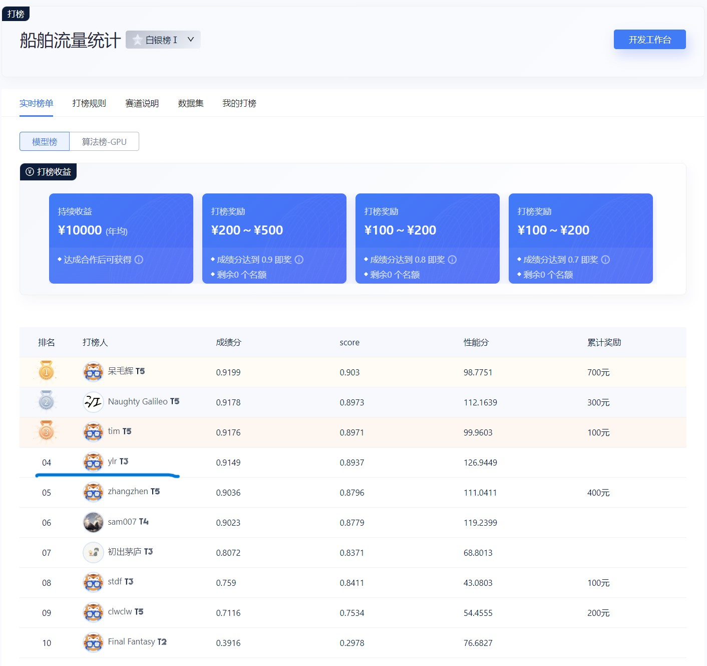

# 打榜


## 1、训练策略

模型选择yolov5s。首先，在训练之前，我们将训练集进行划分训练集：测试集为8:2。数据集保存在/home/data中，我们将VOC格式的数据集转成txt格式给yolov5调用。

提升精度：使用kmeans聚类，尝试将anchor大小更贴近小目标(yolov5自带autoanchor，效果不大)。将backbone冻结，用yolov5自带超参数搜索(遗传)，最后用搜索出的yaml文件进行训练，效果略微提升。后面通过tensorboard发现训练过程中明显欠拟合，改用yolo5m文件配置进行训练，性能轻松上0.7。

测试的时候有两个类别不平衡(其实影响不大)，可选取 --image-weights(数据加载权重分配),增加fl_gamma的值(不建议处理不平衡，会影响其他主要类别的精度和召回)。

训练img_ize=480,防止cuda内存不够(默认640)

平台T4功率较低，训练轮次太少，可以保存好训练的权重文件，下次继续预加载训练。

## 2、优化模型

模型优化部分主要尝试以下三种方式。

### 1) 轻量化

设计轻级特征提取部分，使用 ShuffleNetv2 Block 替换原特征提取部分，压缩模型的大小和参数 

```
# YOLOv5 v6.0 backbone
backbone:
  # [from, number, module, args]
  # Shuffle_Block: [out, stride]
  [[ -1, 1, conv_bn_relu_maxpool, [ 32 ] ], # 0-P2/4
   [ -1, 1, Shuffle_Block, [ 128, 2 ] ],  # 1-P3/8
   [ -1, 3, Shuffle_Block, [ 128, 1 ] ],  # 2
   [ -1, 1, Shuffle_Block, [ 256, 2 ] ],  # 3-P4/16
   [ -1, 3, Shuffle_Block, [ 256, 1 ] ],  # 4
   [ -1, 1, Shuffle_Block, [ 512, 2 ] ],  # 5-P5/32
   [ -1, 3, Shuffle_Block, [ 512, 1 ] ],  # 6
  ]
```

### 2) 增加注意力

添加SKA注意力机制，增强感受野的同时提高检测精度

```
# YOLOv5 v6.0 head
head:
  [[-1, 1, Conv, [512, 1, 1]],
   [-1, 1, nn.Upsample, [None, 2, 'nearest']],
   [[-1, 6], 1, Concat, [1]],  # cat backbone P4
   [-1, 3, C3, [512, False]],  # 13

   [-1, 1, Conv, [256, 1, 1]],
   [-1, 1, nn.Upsample, [None, 2, 'nearest']],
   [[-1, 4], 1, Concat, [1]],  # cat backbone P3
   [-1, 3, C3, [256, False]],  # 17 (P3/8-small)

   [-1, 1, Conv, [256, 3, 2]],
   [[-1, 14 ], 1, Concat, [1]],  # cat head P4
   [-1, 3, C3, [512, False]],  # 20 (P4/16-medium)

   [-1, 1, Conv, [512, 3, 2]],
   [[-1, 10], 1, Concat, [1]],  # cat head P5
   [-1, 3, C3, [1024, False]],  # 23 (P5/32-large)
   [-1, 1, SKAttention, [1024]],  #SKA

   [[17, 20, 24], 1, Detect, [nc, anchors]],  # Detect(P3, P4, P5)
  ]
```

### 3) 增加尺度

在 YOLOv5s 模型的基础上增加一个小目标检测层，通过增加模型对细粒特征的分辨能力

```
# anchors
anchors:
  - [5,6, 8,14, 15,11]  #4
  - [10,13, 16,30, 33,23]  # P3/8
  - [30,61, 62,45, 59,119]  # P4/16
  - [116,90, 156,198, 373,326]  # P5/32

# YOLOv5 head
head:
  [[-1, 1, Conv, [512, 1, 1]], #20*20 8
   [-1, 1, nn.Upsample, [None, 2, 'nearest']],  # 40*40
   [[-1, 6], 1, Concat, [1]],  # cat backbone P4
   [-1, 3, C3, [512, False]],  # 11

   [-1, 1, Conv, [512, 1, 1]], #40*40 12
   [-1, 1, nn.Upsample, [None, 2, 'nearest']], #13
   [[-1, 4], 1, Concat, [1]],  # cat backbone P3   80*80
   [-1, 3, C3, [512, False]],  # 15 (P3/8-small)  80*80

   [-1, 1, Conv, [256, 1, 1]], #16  80*80
   [-1, 1, nn.Upsample, [None, 2, 'nearest']], #17 160*160
   [[-1, 2], 1, Concat, [1]],  #18 cat backbone p2  160*160
   [-1, 3, C3, [256, False]],  #19 160*160

   [-1, 1, Conv, [256, 3, 2]], #20 80*80
   [[-1, 16], 1, Concat, [1]], #21 80*80
   [-1, 3, C3, [256, False]],  # 22 
   [-1, 1, Conv, [256, 3, 2]], #23   40*40
   [[-1, 12], 1, Concat, [1]], #24 cat head P4  40*40
   [-1, 3, C3, [512, False]],  # 25 (P4/16-medium) 40*40

   [-1, 1, Conv, [512, 3, 2]],  #26  20*20
   [[-1, 8], 1, Concat, [1]],  #27 cat head P5  20*20
   [-1, 3, C3, [1024, False]],  # 28 (P5/32-large)  20*20
   [-1, 1, SKAttention, [1024]],  #SKA 29


   [[19, 22, 25, 29], 1, Detect, [nc, anchors]],  # Detect(P2, P3, P4, P5)
  ]
```

整体修改框架：


**效果：**

1. **轻量化后fps提升10个点，但是精度下降将多，考虑到精度得分占比较高，以此不作轻量化。**
2. **增加注意力后F1得分提高1个点。**
3. **增加第4个anchor尺度后F1得分提高4个点，但fps略有下降。**

模型优化前：



模型优化后：



#########################################################################

## 3、在模型优化基础上进一步trick提升！！！

**学习冠军方案和自己不断总结**

尝试了yolov7，发现精度和fps在此榜中都比yolov5略低，于是还是进一步优化yolov5。考虑到yolov5s的fps本身也不高，选用yolov5m的fps会大幅下降，于是还是通过yolov5s进一步优化精度和fps

### 1) 从测试代码ji.py改进

主要修改img、conf_thres、iou_thres这几项参数,imgsz尺寸过大严重影响运算时间,可以自己调整正常训练的640,以及480,为了fps更高也可以480-32*N,自己去试验fps得分了,当然fps快了,模型精度也是会下降的。**注意最好训练和onnx导出以及测试的img都保持一致，其中onnx导出以及测试的img必须一致，否则会出错!**最终反复测试，选择了img=320，fps提升120-130，几乎比之前翻了一倍，精度也提升了4个点，上0.8。conf_thres和iou_thres是nms的阈值,自己经验是由小往大慢慢调试，最终调成0.4和0.7发现性能最优，精度继续上升2个点

### 2) 从训练前参数改进

*数增强策略*:从数据角度，通过粘贴、裁剪、mosaic、仿射变换、颜色空间转换等对样本进行增强，增加目标多样性，以提升模型的检测与分类精度。

*训练结束通过查看tensorboard* 的metrics可以知道lr的是否过大,如下图学习率过大容易导致loss下不去。(主要是展示上下波动频率大,不要在意数值)，P精确率在上下震荡中,就说明lr 学习率就过大了,可以适当调小学习率。


*--cache和编解码读取*最初我们直接采用yolov5训练，这种数据加载方式是以张为单位，基于像素的访问，但是训练时速度很慢，可能受其他线程影响造成的，大概一轮要40分钟左右。然后我们就尝试了cache这种方式，它是将所有训练数据存入到内存中，我们以6406403的输入图像为例，占道数据总共有10147张，全部读进去大约占11.6G的内存，平台是提供12G的内存，几乎将内存占满，也会导致训练变慢；于是我们就尝试改进训练读取数据方式，我们采用的是cache+图像编解码的方式，内存占用仅是cache的1/6，由于添加了编解码，速度比cache慢点，但从数据比较来看，相差无几。这样既能节省内存又能加快训练速度。节省了我们训练过程的极力值和加快实验的步伐，训练时间缩小了12倍！！！编解码节省的内存还可以适当加大batch_size通过更多的轮数增加迭代效果

```
  # 利用opencv编写编解码时，报了很多错，主要是存在内存中读取为空和原始图像分辨率超过65500！
  # 最终修改为下面代码成功训练
        
        # 使用cv2编码 压缩图像
        else:  # 'ram'
            self.ims[i], self.im_hw0[i], self.im_hw[i] = x  # im, hw_orig, hw_resized = load_image(self, i)
            # self.ims[i] = None if self.ims[i] is None else cv2.resize(self.ims[i],(640,640),interpolation=cv2.INTER_NEAREST) # 一般不用
            self.ims[i] = None if self.ims[i] is None else np.array(cv2.imencode('.jpg', self.ims[i])[1])
        -------------------------------------------------------------------------------------------------------------------
        im, f, fn = self.ims[i], self.im_files[i], self.npy_files[i],
        # 使用cv2解码
        if im is None:  # not cached in RAM
            if fn.exists():  # load npy
                im = np.load(fn)
            else:  # read image
                im = cv2.imread(f)  # BGR
                assert im is not None, f'Image Not Found {f}'
            h0, w0 = im.shape[:2]  # orig hw
            r = self.img_size / max(h0, w0)  # ratio
            if r != 1:  # if sizes are not equal
                interp = cv2.INTER_LINEAR if (self.augment or r > 1) else cv2.INTER_AREA
                im = cv2.resize(im, (int(w0 * r), int(h0 * r)), interpolation=interp)
            return im, (h0, w0), im.shape[:2]  # im, hw_original, hw_resized
        im = None if im is None else cv2.imdecode(im, cv2.IMREAD_COLOR)
        return im, self.im_hw0[i], self.im_hw[i]  # im, hw_original, hw_resized
```
*Varifocal Loss损失函数*    
Varifocal Loss主要训练密集目标检测器使IOU感知的分类得分（IASC）回归，来提高检测精度。而目标遮挡是密集目标的特征之一，因此尝试使用该loss来缓解目标遮挡造成漏检现象。并且与focal loss不同，varifocal loss是不对称对待正负样本所带来的损失。
将yolov5中的Focal loss替换成如下代码即可
```
class VFLoss(nn.Module):
    def __init__(self, loss_fcn, gamma=1.5, alpha=0.25):
        super(VFLoss, self).__init__()
        # 传递 nn.BCEWithLogitsLoss() 损失函数  must be nn.BCEWithLogitsLoss()
        self.loss_fcn = loss_fcn  #
        self.gamma = gamma
        self.alpha = alpha
        self.reduction = loss_fcn.reduction
        self.loss_fcn.reduction = 'none'  # required to apply VFL to each element
 
    def forward(self, pred, true):
 
        loss = self.loss_fcn(pred, true)
 
        pred_prob = torch.sigmoid(pred)  # prob from logits
 
        focal_weight = true * (true > 0.0).float() + self.alpha * (pred_prob - true).abs().pow(self.gamma) * (true <= 0.0).float()
        loss *= focal_weight
 
        if self.reduction == 'mean':
            return loss.mean()
        elif self.reduction == 'sum':
            return loss.sum()
        else:
            return loss

```
效果：但最终测试精度大大下降！！！分析：虽然样本存在不均匀，但不均匀的测试样本实在太少，所以提升不均匀样本精度的同时主要部分标签的测试精度下降很多，可能在密集数据集中效果不错，最终弃用!    
*SAM优化器：*    
SAM优化器可使损失值和损失锐度同时最小化，并可以改善各种基准数据集（例如CIFAR-f10、100g，ImageNet，微调任务）和模型的模型泛化能力，从而产生了多种最新性能。另外， SAM优化器具有固有的鲁棒性。添加调试成功之后发现精度只提升了0.2个点，且训练时间多了2倍，于是弃用！
### 3) 从训练代码改进

使用EIou替换CIoU加快模型收敛

**冻结训练：**
在训练过程中采取常规训练与冻结训练想相结合的方式迭代，进一步抑制训练过程中容易出现的过拟合现象，具体训练方案是：1）常规训练；2）加入冻结模块的分步训练

第一步：进行yolov5常规训练，该过程中所有的参数是同时更新的；
第二步：将常规pt进行freez：冻结模块的特点就是将backbone和head轮流冻结，每epoch只更新未冻结部分的参数。我们以5个epoch为一个阶段，第一个epoch为head冻结，只训练backbone；第2~5个epoch为backbone冻结，只训练head。这样轮流更新backbone和head的参数，具体过程如下：


网上基本只是一笔带过，于是自己在梯度更新和反向传播之前加入以下代码：
```
            # freeze backbone
            backbone, head = [10], [24]
            if epoch % 5 != 0:
                Freeze = [f'model.{x}.' for x in (backbone if len(backbone) > 1 else range(backbone[0]))]  # layers to freeze
            else:
                Freeze = [f'model.{x}.' for x in (head if len(head) > 1 else range(10, head[0]))]  # layers to freeze
                for k, v in model.named_parameters():
                    v.requires_grad = True  # train all layers
                    # v.register_hook(lambda x: torch.nan_to_num(x))  # NaN to 0 (commented for erratic training results)
                    if any(x in k for x in Freeze):
                        LOGGER.info(f'freezing {k}')
                        v.requires_grad = False

            scaler.scale(loss).backward()
```
最终效果：测试精度再次上升5个点！！！可以看到只比常年站榜的前三名大佬最终得分只低一点点，且fps最好有130+，比所有人都高！   
*ps：如果还想提升一点精度，可以把之前的sam优化加上，或者尝试其他的模型架构*


## 3、其余收集链接：
Reparameterization-https://github.com/WongKinYiu/yolov7/blob/main/tools/reparameterization.ipynb +fps    

YOLOV8改进-添加注意力机制 附带几十种注意力机制代码-添加Wise-IoU-添加可变形卷积(DCNV2)-https://blog.csdn.net/qq_37706472/article/details/128679699?spm=1001.2101.3001.6661.1&utm_medium=distribute.pc_relevant_t0.none-task-blog-2%7Edefault%7EBlogCommendFromBaidu%7ERate-1-128679699-blog-130472736.235%5Ev35%5Epc_relevant_increate_t0_download_v2&depth_1-utm_source=distribute.pc_relevant_t0.none-task-blog-2%7Edefault%7EBlogCommendFromBaidu%7ERate-1-128679699-blog-130472736.235%5Ev35%5Epc_relevant_increate_t0_download_v2&utm_relevant_index=1

获得最佳训练效果的技巧-https://github.com/ultralytics/yolov5/wiki/Tips-for-Best-Training-Results

用于数据集、标签和主动学习的 Roboflow-https://github.com/ultralytics/yolov5/issues/4975

测试时数据增强 (TTA)-https://github.com/ultralytics/yolov5/issues/303

模型集成-https://github.com/ultralytics/yolov5/issues/318

模型剪枝/稀疏性-https://github.com/ultralytics/yolov5/issues/304
def prune(model, amount=0.3): 
     # Prune model to requested global sparsity 
     import torch.nn.utils.prune as prune 
     print('Pruning model... ', end='') 
     for name, m in model.named_modules(): 
         if isinstance(m, nn.Conv2d): 
             prune.l1_unstructured(m, name='weight', amount=amount)  # prune 
             prune.remove(m, 'weight')  # make permanent 
     print(' %.3g global sparsity' % sparsity(model)) 

超参数进化-https://github.com/ultralytics/yolov5/issues/607

架构概要-https://github.com/ultralytics/yolov5/issues/6998  、

AMP-https://zhuanlan.zhihu.com/p/500060805