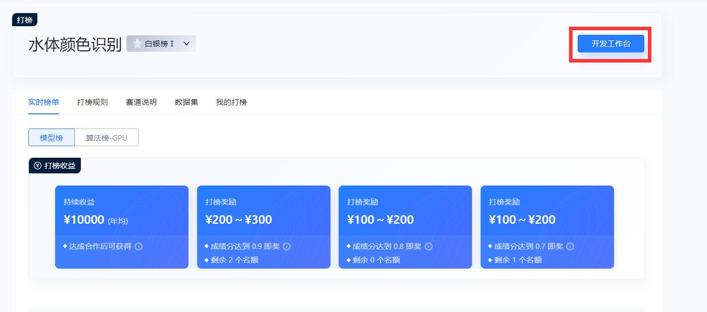
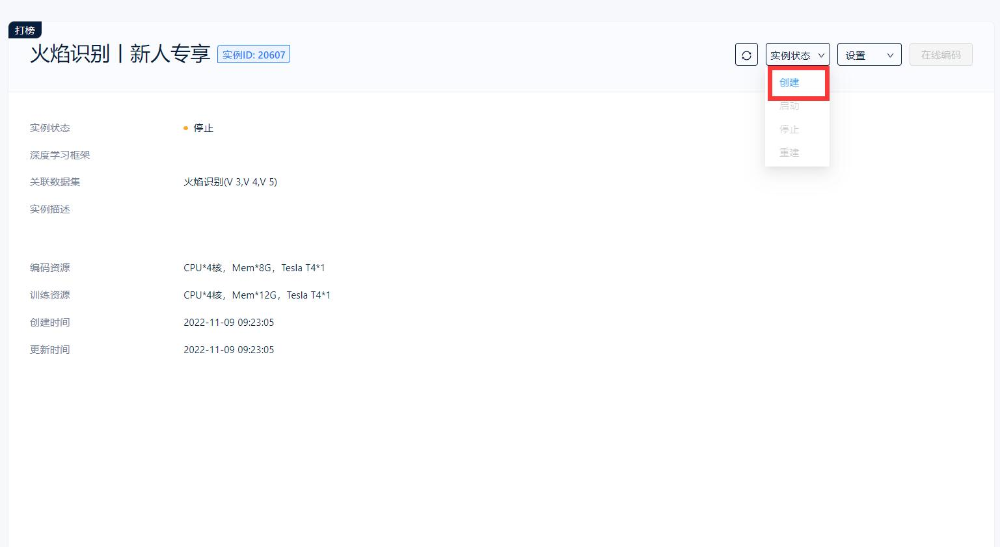
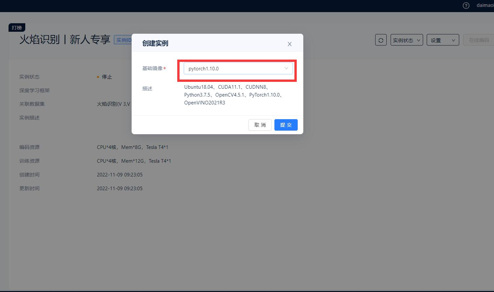
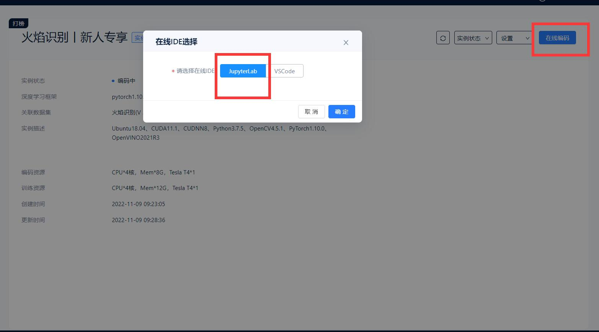
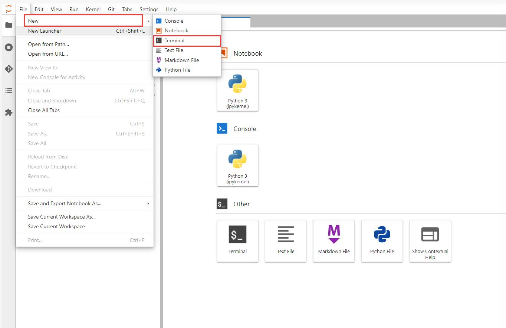
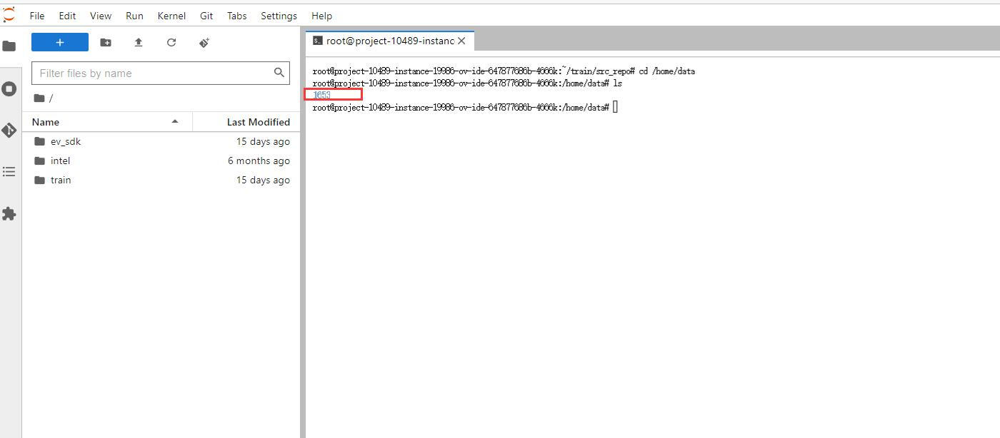
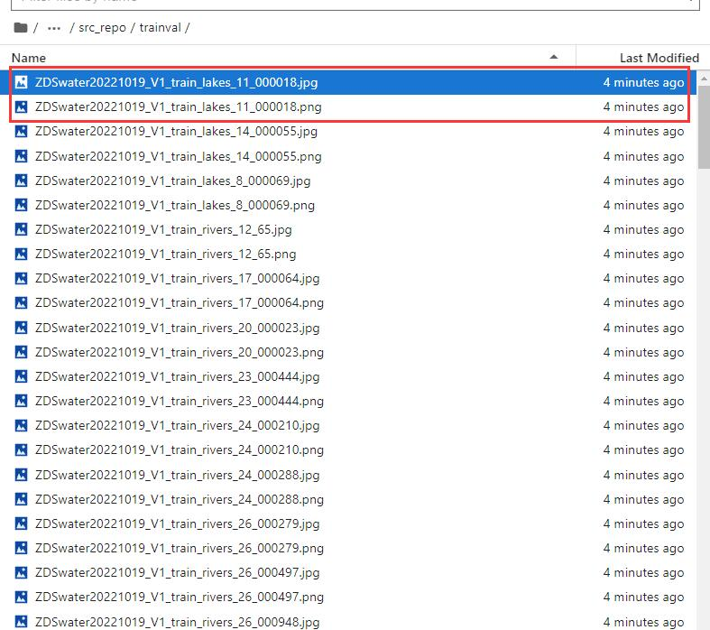
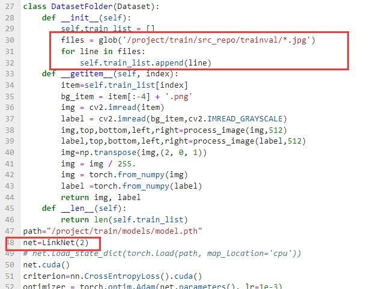
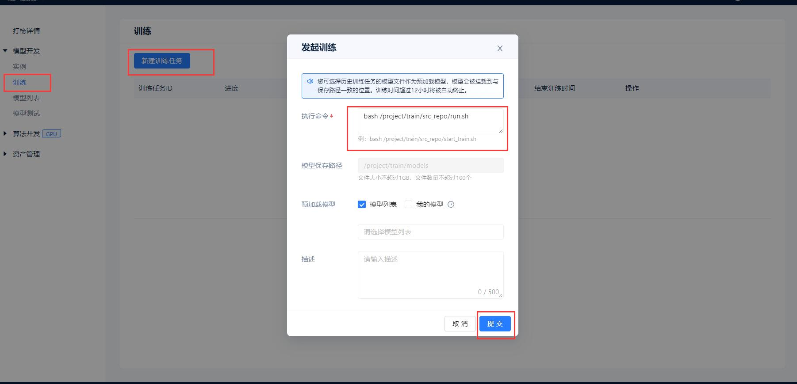
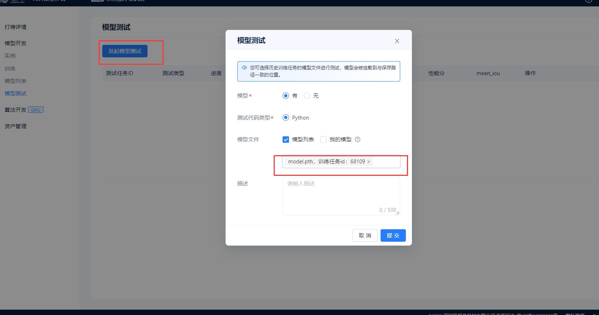

# cvmart_linknet

2022-12-1

**添加IOU-loss函数**

**添加数据增强代码**

## 1.报名打榜



## 2.创建镜像




**选择pytorch1.10**




**进入编码环境**




## 3.编码环境

### 3.1 查看数据

**新建命令行窗口**



```shell
#新建Terminal
cd /home/data
ls
```



**会发现这个赛题只有一个数据集文件夹**

**将数据拷贝到/project/train/src_repo**


```shell
cp -r /home/data/1653 /project/train/src_repo/trainval
```

**查看数据集，语义分割赛题数据集为一张原图，一张分割图片，就是名字相同的.jpg和.png两张图片**，**.png查看是全黑的图像，.png每个像素点的值代表类别，比如一个点的像素点的值为0，那么该像素点的类别为0**



### 3.2 linknet代码以及train.py 代码

​      **linkNet.py和train.py 已经放置到code文件夹中**

​	 **代码修改** 

​						**1. 需要修改读取数据这里代码，记得修改路径的**

​					     **2. Linknet 这里的类别数量**


​	

###  3.3 run.sh 文件

```shell
cp -r /home/data/1653 /project/train/src_repo/trainval
python /project/train/src_repo/train.py
```

## 4.发起训练

```shell
bash /project/train/src_repo/run.sh
```



## 5.发起测试

**在 ev_sdk/src/ 目录下新建ji.py** 

