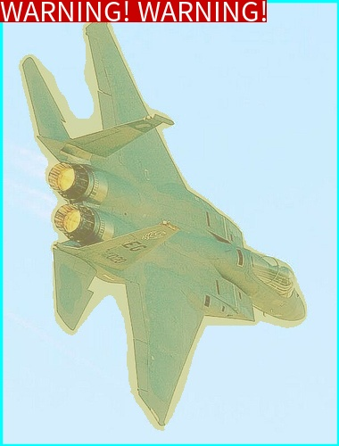

# EV_SDK

## 说明
### EV_SDK的目标
开发者专注于算法开发及优化，最小化业务层编码，即可快速部署到生产环境，共同打造商用级高质量算法。
### 极市平台做了哪些
1. 统一定义算法接口：针对万千视频和图片分析算法，抽象出接口，定义在`include`目录下的`ji.h`文件中
2. 提供工具包：比如jsoncpp库，wkt库，在`3rd`目录下
3. 应用层服务：此模块不在ev_sdk中，比如视频处理服务、算法对外通讯的http服务等

### 开发者需要做什么
1. 模型的训练和调优
2. 实现`ji.h`约定的接口
3. 实现约定的输入输出
4. 其他后面文档提到的功能

## 目录

### 代码目录结构

```
ev_sdk
|-- 3rd             # 第三方源码或库目录，发布时请删除
|   |-- wkt_parser          # 针对使用WKT格式编写的字符串的解析器
|   |-- jsoncpp_simple         # jsoncpp库，简单易用
|   `-- fonts         # 支持中文画图的字体库
|-- CMakeLists.txt          # 本项目的cmake构建文件
|-- README.md       # 本说明文件
|-- model           # 模型数据存放文件夹
|-- config          # 程序配置目录
|   |-- README.md   # algo_config.json文件各个参数的说明和配置方法
|   `-- algo_config.json    # 程序配置文件
|-- doc
|-- include         # 库头文件目录
|   `-- ji.h        # libji.so的头文件，理论上仅有唯一一个头文件
|-- lib             # 本项目编译并安装之后，默认会将依赖的库放在该目录，包括libji.so
|-- src             # 实现ji.cpp的代码
`-- test            # 针对ji.h中所定义接口的测试代码，请勿修改！！！
```

## <span id="jump">!!开发SDK的一般步骤(开发者重点关注的部分)</span>

1. 获取demo源码,将源码拷贝至目标路径/usr/local/ev_sdk（**注意！！！整个demo是属于一个git工程，避免将git工程的隐藏文件，如.git目录，放到目标路径/usr/local/ev_sdk中,因为ev_sdk目录也是一个git工程目录；建议是拷贝而不是直接把demo的目录名称重命名为ev_sdk而把原始ev_sdk覆盖掉或者把原始ev_sdk工程目录删掉；否则容易引起一些未知的错误**）
2. 添加修改算法业务逻辑代码后编译ev_sdk，注意修改ji.cpp中的版本号algo_version,执行完成之后，`/usr/local/ev_sdk/lib`下将生成`libji.so`和相关的依赖库，以及`/usr/local/ev_sdk/bin/`下的测试程序`test-ji-api`。需要注意的是**一定要有install,目的是将相应地库都安装到ev_sdk/lib下面**
  ```shell
        #编译SDK库
        mkdir -p /usr/local/ev_sdk/build
        cd /usr/local/ev_sdk/build
        cmake ..
        make install 
        #编译测试工具
        mkdir -p /usr/local/ev_sdk/test/build
        cd /usr/local/ev_sdk/test/build
        cmake ..
        make install 
  ```
3. 测试,我们提供了测试工具test-ji-api方便开发者进行算法的快速测试,在下面的[demo测试](#jump_dev_test)中我们将演示如何使用测试工具进行基本的测试(**这点非常重要,开发者需要先自测通过再提交算法**)

## demo说明
本项目基于极视平台EV_SDK4.0标准作为模板进行算法封装，旨在为开发者提供最直观的关于SDK4.0的理解. 本项目中我们利用onnxruntime框架进行模型推理, 实现一个deeplabv3plus的语义分割算法

### demo源码介绍
我们在demo开发中采用单一职责原则,将算法逻辑处理,模型推理,配置管理等功能封装到不同的C++类中,方便算法的开发和维护.
1. 在SampleAlgorithm.cpp文件中我们封装了算法逻辑,通过该对象的实现算法的初始化,调用,反初始化,配置更新等功能.对象内部保存json字符串的成员变量,以及返回图片对象的成员变量,如果开发这按照如下的几个接口封装算法类,则只需在ji.cpp中更改算法版本信息algo_version,无需做其他更改.

    ```
    在ji.cpp ji_predictor_detector 中调用算法的初始化接口:        
        STATUS Init();

    在ji.cpp ji_calc_image 中调用算法分析接口和返回图片获取接口:
        STATUS Process(const Mat &inFrame, const char *args, JiEvent &event);
        STATUS GetOutFrame(JiImageInfo **out, unsigned int &outCount);
    
    在ji.cpp ji_destroy_detector 中调用算法反初始化接口:
        STATUS UnInit();

    在ji.cpp ji_update_config 中调用算法配置更新接口:
        STATUS UpdateConfig(const char *args);
    ```
2. 在Configuration.hpp文件中,我们封装了一个简单易用的配置管理工具,其中已经包含了一些常见的配置项,开发者需要根据算法需求自行增加或者删减配置项,下面演示如何基于配置管理类快速增加配置.假设我们需要增加一个nms阈值,只需在Configuration.hpp中增加如下两句,删除配置像亦然.
```
    struct Configuration
    {
        ..............
        float nms_thresh = 0.45; //增加成员
        ..............
        void ParseAndUpdateArgs(const char *confStr)
        {
            ..............
            checkAndUpdateNumber("nms_thresh", nms_thresh); //增加更新操作
            ..............
        }
        ..............
    }    
```
3. SampleDetector.cpp 中我们封装了一个基于onnx_runtime的deeplabveplus的语义分割类, 用来分割物体.
4. demo运行的基础镜像及容器启动命令
   
```
运行镜像环境
ccr.ccs.tencentyun.com/public_images/ubuntu16.04-cuda11.1-cudnn8.0-ffmpeg4.2-opencv4.1.2-tensorrt7.2.3-code-server3.5.0-ev_base:v1.0

容器运行命令
nvidia-docker run -itd --privileged ccr.ccs.tencentyun.com/public_images/ubuntu16.04-cuda11.1-cudnn8.0-ffmpeg4.2-opencv4.1.2-tensorrt7.2.3-code-server3.5.0-ev_base:v1.0 /bin/bash
```
### [demo测试](#jump_dev_test)
我们按照[开发SDK的一般步骤](#jump_dev)编译并授权过后即可运行测试工具,测试工具主要提供一下几个功能

```
          ---------------------------------
          usage:
            -h  --help        show help information
            -f  --function    test function for 
                              1.ji_calc_image
                              2.ji_calc_image_asyn
                              3.ji_destroy_predictor
                              4.ji_thread
                              5.ji_get_version
                              6.ji_insert_face
                              7.ji_delete_face
            -i  --infile      source file
            -a  --args        for example roi
            -u  --args        test ji_update_config
            -o  --outfile     result file
            -r  --repeat      number of repetitions. default: 1
                              <= 0 represents an unlimited number of times
                              for example: -r 100
        ---------------------------------
```

下面我们对部分功能进行详细的说明
1. 测试功能, 1指同步调用接口, 2指异步调用接口, 3会在每次调用算法前后执行ji_create_predictor,ji_destroy_predictor接口初始化和反初始化算法,以测试SDK是否能够正确释放资源,指定功能3的时候一定要和-r参数配合使用,在运行过程中监控test-ji-api的内存占用,显存占用等是否不停的增长,5测试获取版本信息的接口. -i参数指定输入时,可以传递单张图片，也可以输入多张图片,直接用逗号分割(**!!!多张图片是指sdk一次调用ji_calc_image传入的图片数量不是指多次调用，每次传入一张图片**),该参数也可以传递一个文件夹，测试工具会自动分析文件夹中的每一张图片，结果图片会保存在原图片文件的同一路径下，结果文件名和原文件名一一对应(名称中添加了result字段)．
   ```
   ###生成RGB染色图，用于封装sdk
   /usr/local/ev_sdk/bin/test-ji-api -f 1 -i /usr/local/ev_sdk/data/2007_002619.jpg -o result.jpg  
   ```
   

以下为默认参数的输出效果  



输出json信息：

```
code: 0
        json: {
        "algorithm_data" : 
        {
                "is_alert" : true,
                "mask" : "",
                "target_info" : 
                [
                        {
                                "name" : "aeroplane",
                                "points" : 
                                [
                                        112,
                                        13,
                                        92,
                                        32,
                                        97,
                                        67,
                                        95,
                                        90,
                                        105,
                                        114,
                                        105,
                                        125,
                                        99,
                                        133,
                                        84,
                                        131,
                                        60,
                                        85,
                                        43,
                                        66,
                                        31,
                                        61,
                                        21,
                                        72,
                                        38,
                                        154,
                                        54,
                                        180,
                                        51,
                                        202,
                                        65,
                                        224,
                                        57,
                                        240,
                                        66,
                                        267,
                                        57,
                                        275,
                                        61,
                                        354,
                                        70,
                                        370,
                                        81,
                                        375,
                                        117,
                                        332,
                                        127,
                                        332,
                                        139,
                                        356,
                                        146,
                                        439,
                                        168,
                                        474,
                                        183,
                                        482,
                                        201,
                                        448,
                                        217,
                                        393,
                                        232,
                                        364,
                                        285,
                                        364,
                                        293,
                                        359,
                                        329,
                                        366,
                                        342,
                                        357,
                                        343,
                                        341,
                                        326,
                                        300,
                                        278,
                                        276,
                                        265,
                                        251,
                                        209,
                                        205,
                                        181,
                                        147,
                                        194,
                                        136,
                                        160,
                                        112,
                                        126,
                                        31
                                ]
                        }
                ]
        },
        "model_data" : 
        {
                "mask" : "",
                "polygons" : 
                [
                        {
                                "name" : "aeroplane",
                                "points" : 
                                [
                                        112,
                                        13,
                                        92,
                                        32,
                                        97,
                                        67,
                                        95,
                                        90,
                                        105,
                                        114,
                                        105,
                                        125,
                                        99,
                                        133,
                                        84,
                                        131,
                                        60,
                                        85,
                                        43,
                                        66,
                                        31,
                                        61,
                                        21,
                                        72,
                                        38,
                                        154,
                                        54,
                                        180,
                                        51,
                                        202,
                                        65,
                                        224,
                                        57,
                                        240,
                                        66,
                                        267,
                                        57,
                                        275,
                                        61,
                                        354,
                                        70,
                                        370,
                                        81,
                                        375,
                                        117,
                                        332,
                                        127,
                                        332,
                                        139,
                                        356,
                                        146,
                                        439,
                                        168,
                                        474,
                                        183,
                                        482,
                                        201,
                                        448,
                                        217,
                                        393,
                                        232,
                                        364,
                                        285,
                                        364,
                                        293,
                                        359,
                                        329,
                                        366,
                                        342,
                                        357,
                                        343,
                                        341,
                                        326,
                                        300,
                                        278,
                                        276,
                                        265,
                                        251,
                                        209,
                                        205,
                                        181,
                                        147,
                                        194,
                                        136,
                                        160,
                                        112,
                                        126,
                                        31
                                ]
                        }
                ]
        }
}
```

其中name表示分割区域的类别名，points表示分割区域的外接多边形的顶点的坐标


```
###生成mask全黑图，用于发起测试
/usr/local/ev_sdk/bin/test-ji-api -f 1 -i /usr/local/ev_sdk/data/2007_002619.jpg -a '{"mask_output_path":"/project/mask.png"}'  
```

程序会生成一个mask.png图片，图片是全黑色的，图片里的每个点的像素值表示类别索引号。

输出json信息：

```
code: 0
        json: {
        "algorithm_data" : 
        {
                "is_alert" : true,
                "mask" : "/project/mask.png",
                "target_info" : 
                [
                        {
                                "name" : "aeroplane",
                                "points" : 
                                [
                                        112,
                                        13,
                                        92,
                                        32,
                                        97,
                                        67,
                                        95,
                                        90,
                                        105,
                                        114,
                                        105,
                                        125,
                                        99,
                                        133,
                                        84,
                                        131,
                                        60,
                                        85,
                                        43,
                                        66,
                                        31,
                                        61,
                                        21,
                                        72,
                                        38,
                                        154,
                                        54,
                                        180,
                                        51,
                                        202,
                                        65,
                                        224,
                                        57,
                                        240,
                                        66,
                                        267,
                                        57,
                                        275,
                                        61,
                                        354,
                                        70,
                                        370,
                                        81,
                                        375,
                                        117,
                                        332,
                                        127,
                                        332,
                                        139,
                                        356,
                                        146,
                                        439,
                                        168,
                                        474,
                                        183,
                                        482,
                                        201,
                                        448,
                                        217,
                                        393,
                                        232,
                                        364,
                                        285,
                                        364,
                                        293,
                                        359,
                                        329,
                                        366,
                                        342,
                                        357,
                                        343,
                                        341,
                                        326,
                                        300,
                                        278,
                                        276,
                                        265,
                                        251,
                                        209,
                                        205,
                                        181,
                                        147,
                                        194,
                                        136,
                                        160,
                                        112,
                                        126,
                                        31
                                ]
                        }
                ]
        },
        "model_data" : 
        {
                "mask" : "/project/mask.png",
                "polygons" : 
                [
                        {
                                "name" : "aeroplane",
                                "points" : 
                                [
                                        112,
                                        13,
                                        92,
                                        32,
                                        97,
                                        67,
                                        95,
                                        90,
                                        105,
                                        114,
                                        105,
                                        125,
                                        99,
                                        133,
                                        84,
                                        131,
                                        60,
                                        85,
                                        43,
                                        66,
                                        31,
                                        61,
                                        21,
                                        72,
                                        38,
                                        154,
                                        54,
                                        180,
                                        51,
                                        202,
                                        65,
                                        224,
                                        57,
                                        240,
                                        66,
                                        267,
                                        57,
                                        275,
                                        61,
                                        354,
                                        70,
                                        370,
                                        81,
                                        375,
                                        117,
                                        332,
                                        127,
                                        332,
                                        139,
                                        356,
                                        146,
                                        439,
                                        168,
                                        474,
                                        183,
                                        482,
                                        201,
                                        448,
                                        217,
                                        393,
                                        232,
                                        364,
                                        285,
                                        364,
                                        293,
                                        359,
                                        329,
                                        366,
                                        342,
                                        357,
                                        343,
                                        341,
                                        326,
                                        300,
                                        278,
                                        276,
                                        265,
                                        251,
                                        209,
                                        205,
                                        181,
                                        147,
                                        194,
                                        136,
                                        160,
                                        112,
                                        126,
                                        31
                                ]
                        }
                ]
        }
}
```

#### 规范要求
规范测试大部分内容依赖于内置的`/usr/local/ev_sdk/test`下面的代码，这个测试程序会链接`/usr/local/ev_sdk/lib/libji.so`库，`EV_SDK`封装完成提交后，极市方会使用`test-ji-api`程序测试`ji.h`中的所有接口。测试程序与`EV_SDK`的实现没有关系，所以请**请不要修改`/usr/local/ev_sdk/test`目录下的代码！！！**

1. 接口功能要求
  
   - 确定`test-ji-api`能够正常编译，并且将`test-ji-api`移动到任意目录，都需要能够正常运行；
   
   - 在提交算法之前，请自行通过`/usr/local/ev_sdk/bin/test-ji-api`测试接口功能是否正常；
   
   - 未实现的接口需要返回`JISDK_RET_UNUSED`；
   
   - 实现的接口，如果传入参数异常时，需要返回`JISDK_RET_INVALIDPARAMS`；
   
   - 输入图片和输出图片的尺寸应保持一致；
   
   - 对于接口中传入的参数`args`，根据项目需求，算法实现需要支持`args`实际传入的参数。
   
     例如，如果项目需要支持在`args`中传入`roi`参数，使得算法只对`roi`区域进行分析，那么**算法内部必须实现只针对`roi`区域进行分析的功能**；
   
   - 通常输出图片中需要画`roi`区域、目标框等，请确保这一功能正常，包括但不仅限于：
   
     - `args`中输入的`roi`需要支持多边形
     - 算法默认分析区域必须是全尺寸图，如当`roi`传入为空时，算法对整张图进行分析；
     
   - 为了保证多个算法显示效果的一致性，与画框相关的功能必须优先使用`ji_utils.h`中提供的工具函数；
   
   > 1. ` test-ji-api`的使用方法可以参考上面的使用示例以及运行`test-ji-api --help`；
   > 2. 以上要求在示例程序`ji.cpp`中有实现；
   
2. 业务逻辑要求

   针对需要报警的需求，算法必须按照以下规范输出结果：
   * 报警时输出：`JI_EVENT.code=JISDK_CODE_ALARM`，`JI_EVENT.json`内部填充`"is_alert" : true`；
   * 未报警时输出：`JI_EVENT.code=JISDK_CODE_NORMAL`，`JI_EVENT.json`内部填充`"is_alert" : false`；
   * 处理失败的接口返回`JI_EVENT.code=JISDK_CODE_FAILED`


3. 算法配置选项要求

   - **配置文件必须遵循[`EV_SDK`配置协议](./doc/EV_SDK配置协议说明.md)**；
   - 所有算法与`SDK`可配置参数**必须**存放在统一的配置文件：`/usr/local/ev_sdk/config/algo_config.json`中；
   - 配置文件中必须实现的参数项：
     - `draw_roi_area`：`true`或者`false`，是否在输出图中绘制`roi`分析区域；
     - `roi_line_thickness`：ROI区域的边框粗细；
     - `roi_fill`：是否使用颜色填充ROI区域；
     - `roi_color`：`roi`框的颜色，以BGRA表示的数组，如`[0, 255, 0, 0]`，参考[model/README.md](model/README.md)；
     - `roi`：针对图片的感兴趣区域进行分析，如果没有此参数或者此参数解析错误，则roi默认值为整张图片区域；
       注：多个点、线、框有两种实现方式：

       - 使用WKT格式，如：`"roi": "MULTIPOLYGON (((40 40, 20 45, 45 30, 40 40)), ((20 35, 10 30, 10 10, 30 5, 45 20, 20 35), (30 20, 20 15, 20 25, 30 20)))"`；
       - 使用数组形式，如：`"roi":["POLYGON ((30 10, 40 40, 20 40, 10 20, 30 10))", "POLYGON ((30 10, 40 40, 20 40, 10 20, 30 10))"]`。

       **`config/README.md`内必须说明使用的是哪一种格式。**

     - `thresh`：算法阈值，需要有可以调整算法灵敏度、召回率、精确率的阈值参数，如果算法配置项有多个参数，请自行扩展，所有与算法效果相关并且可以变动的参数**必须**在`/usr/local/ev_sdk/config/README.md`中提供详细的配置方法和说明（包括类型、取值范围、建议值、默认值、对算法效果的影响等）；
     - `draw_result`：`true`或者`false`，是否绘制分析结果，比如示例程序中，如果检测到狗，是否将检测框和文字画在输出图中；
     - `draw_confidence`：`true`或者`false`，是否将置信度画在检测框顶部，小数点后保留两位；
     - `language`：所显示文字的语言，需要支持`en`和`zh`两种选项，分别对应英文和中文；
     - 所有`json`内的键名称必须是小写字母，并且单词间以下划线分隔，如上面几个示例。
   - **必须支持参数实时更新**。所有`/usr/local/ev_sdk/config/algo_config.json`内的可配置参数必须支持能够在调用`ji_calc_image`、`ji_calc_image_asyn`接口时，进行实时更新。也就是必须要在`ji_calc_*`等接口的`args`参数中，加入这些可配置项。

     根据算法的实际功能和使用场景，参数实时更新功能可能只能够使部分参数有效，其中

     1. 可以通过`ji_calc_image`等接口的`args`参数传入并实时更新的参数，比如示例代码中检测框的颜色`target_rect_color`，这些配置项称为**动态参数**（即可动态变更）；

     2. 其他无法通过`args`参数传入并进行实时更新的参数称为**静态参数**，通常这些参数需要重启算法实例才能生效；

        > **静态参数的名称规范**：
        >
        > 静态参数必须以`static`作为前缀，例如`static_detect_thresh`。

   - **算法开发完成后，必须按照`config/README.md`的模版，修改成当前算法的配置说明**。

4. 算法输出规范要求

   - **算法输出必须遵循[极视算法SDK输出协议](./doc/极视算法SDK输出协议.md)**; 
   - 算法必须要输出基础模型的结果，否则**不予通过**测试
   - `model_data`表示模型输出的原始数据，用于评估原始算法模型的精度,该键值中的`name`或`class`字段一定要与groundtruth中的完全相同，否则会影响模型性能评估

5. 文件结构规范要求

   * 与模型相关的文件必须存放在`/usr/local/ev_sdk/model`目录下，例如权重文件、目标检测通常需要的名称文件`coco.names`等。
   * 最终编译生成的`libji.so`必须自行链接必要的库，`test-ji-api`不会链接除`/usr/local/ev_sdk/lib/libji.so`以外的算法依赖库；
   * 如果`libji.so`依赖了系统动态库搜索路径（如`/usr/lib`，`/lib`等）以外的库，必须将其安装到`/usr/local/ev_sdk/lib`下，可以使用`ldd /usr/local/ev_sdk/lib/libji.so`查看`libji.so`是否正确链接了所有的依赖库。

## FAQ

### 如何使用接口中的`args`？

通常，在实际项目中，外部需要将多种参数（例如`ROI`）传入到算法，使得算法可以根据这些参数来改变处理逻辑。`EV_SDK`接口（如`int ji_calc_image(void* predictor, const JiImageInfo* pInFrames, const unsigned int nInCount, const char* args,JiImageInfo **pOutFrames, unsigned int & nOutCount, JiEvent &event)`中的`args`参数通常由开发者自行定义和解析，但只能使用[JSON](https://www.json.cn/wiki.html)格式。格式样例：

```shell
{
    "polygon_1": [
        "POLYGON((0.0480.357,0.1660.0725,0.3930.0075,0.3920.202,0.2420.375))",
        "POLYGON((0.5130.232,0.790.1075,0.9280.102,0.9530.64,0.7590.89,0.510.245))",
        "POLYGON((0.1150.497,0.5920.82,0.5810.917,0.140.932))"
    ]
}
```

例如当算法支持输入`polygon_1`参数时，那么开发者需要在`EV_SDK`的接口实现中解析上面示例中`polygon_1`这一值，提取其中的`polygon_1`参数，并使用`WKTParser`对其进行解析，应用到自己的算法逻辑中。

### 为什么要定义roi_type字段
不同算法需要的点线框格式不同，为了保证上层应用能正确地下发`args`参数，需要开发者通过`roi_type`字段说明算法支持的类型，如：
```shell
{
   "roi_type":"polygon_1;"
   "polygon_1": ["POLYGON((0.0480.357,0.1660.0725,0.3930.0075,0.3920.202,0.2420.375))"]
}
```

### 为什么不能且不需要修改`/usr/local/ev_sdk/test`下的代码？

1. `/usr/local/ev_sdk/test`下的代码是用于测试`ji.h`接口在`libji.so`中是否被正确实现，这一测试程序与`EV_SDK`的实现无关，且是极市方的测试标准，不能变动；
2. 编译后`test-ji-api`程序只会依赖`libji.so`，如果`test-ji-api`无法正常运行，很可能是`libji.so`没有按照规范进行封装；

### 为什么运行`test-ji-api`时，会提示找不到链接库？

由于`test-ji-api`对于算法而言，只链接了`/usr/local/ev_sdk/lib/libji.so`库，如果`test-ji-api`运行过程中，找不到某些库，那么很可能是`libji.so`依赖的某些库找不到了。此时

1. 可以使用`ldd /usr/local/ev_sdk/lib/libji.so`检查是否所有链接库都可以找到；
2. 请按照规范将系统动态库搜索路径以外的库放在`/usr/local/ev_sdk/lib`目录下。

### 如何使用`test-ji-api`进行测试？

1. 输入单张图片，并调用`ji_calc_image`接口：

   ```shell
   ./test-ji-api -f ji_calc_image -i /path/to/test.jpg 
   ```

2. 输入`json`格式的`polygon_1`参数到`args`参数：

   ```shell
   ./test-ji-api \
   -f ji_calc_image \
   -i /path/to/test.jpg \
   -a '{"polygon_1":["POLYGON((0.2 0.2,0.7 0.13,0.9 0.7,0.4 0.9,0.05 0.8,0.2 0.25))"]}'
   ```

3. 保存输出图片：

   ```shell
   ./test-ji-api -f ji_calc_image -i /path/to/test.jpg -o /path/to/out.jpg
   ```

更多选项，请参考`test-ji-api --help`

### EV_SDK配置协议的实现样例

[配置协议](doc/EV_SDK配置协议说明.md)规定：

1. 只能有一级*KEY-VALUE*；
2. *VALUE*的类型有两种：
   1. JSON格式定义的非数组和非对象类型，如`string`、`number`、`false`、`true`；
   2. 由配置协议所定义的数据类型；

举例：

1. 算法支持多个ROI时的配置，*VALUE*可以使用协议所定义的多个`POLYGON`类型：

   ```json
   {
     "roi_type":"polygon_1;",
     "polygon_1": ["POLYGON ((0.1 0.1, 0.1 0.1, 0.2 0.3, 0.9 0.9))", "POLYGON ((0.1 0.1, 0.1 0.1, 0.2 0.3, 0.9 0.9))"]
   }
   ```

2. 算法需要多个ROI，并且多个每个ROI表示不同逻辑含义时：

   ```json
   {
     "roi_type":"polygon_1;polygon_2",
     "polygon_1": ["POLYGON ((0.1 0.1, 0.1 0.1, 0.2 0.3, 0.9 0.9))"],
     "polygon_2": ["POLYGON ((0.1 0.1, 0.1 0.1, 0.2 0.3, 0.9 0.9))"]
   }
   ```

   算法内部根据`polygon_1`和`polygon_2`进行逻辑区分。

3. 如果算法需要以组合的形式配置算法，且组合的数量不设限制时，可用如下配置：

   ```json
   {

     "polygon_1": ["POLYGON ((0.1 0.1, 0.1 0.1, 0.2 0.3, 0.9 0.9))"],
     "line_1": ["LINESTRING (0.1 0.1, 0.12 0.15, 0.2 0.3)"],
     "polygon_2": ["POLYGON ((0.1 0.1, 0.1 0.1, 0.2 0.3, 0.9 0.9))"],
     "line_2": ["LINESTRING (0.1 0.1, 0.12 0.15, 0.2 0.3)"]
     ......
   }
   ```

   算法内部需要：

   - 针对字段名称将所设置的值进行组合，例如将`polygon_1`和`line_1`组合为一组，从而合成自己所需的格式；
   - 对于数量，通过字段的数字后缀来遍历得到，例如当外部传入`polygon_3`、`line_3`时，算法内部需要**自行通过遍历获得这第三组配置**；

   以上配置方法必须在实现时写入`config/README.md`配置文档。

4. 行人员闯入算法通常需要配置一个分析区域和一条闯入边界线，可以使用以下配置：

   ```json
   {
     "roi_type":"polygon_1;cross_line_1",
     "polygon_1": ["POLYGON ((0.1 0.1, 0.1 0.1, 0.2 0.3, 0.9 0.9))"],
     "cross_line_1": ["LINESTRING (0.1 0.1, 0.12 0.15, 0.2 0.3)"]
   }
   ```
### 如何使用jsoncpp生成和解析json字符串？
参见src/SampleAlgorithm.cpp中的使用示例
