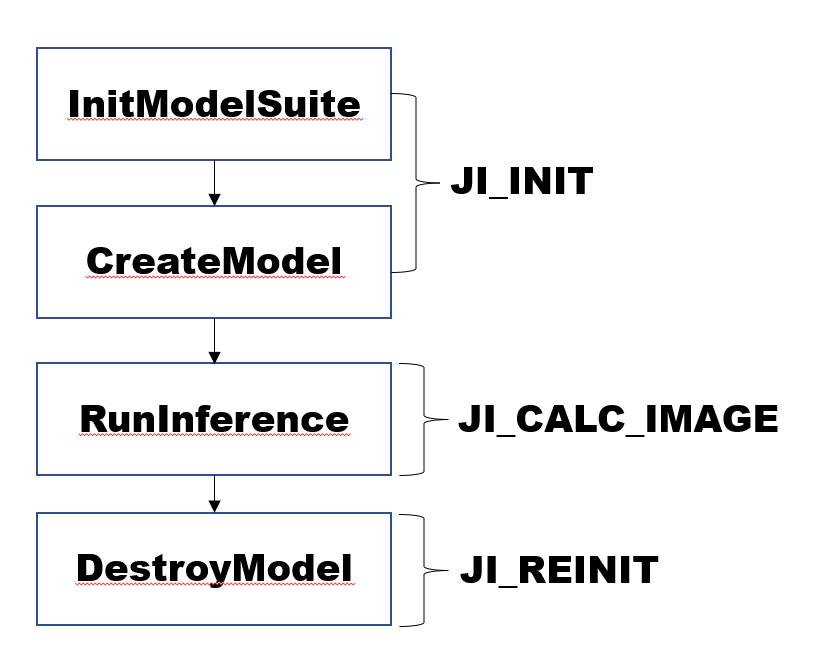

# 基础模型套件使用说明

## 1. 套件功能说明

模型套件通过统一的接口进行模型推理，只需要通过简单的配置文件实现多模型/框架/的调度推理。套件以tar包的形式发布，需要将基础镜像对应的tar包解压到/usr/local/目录下即可使用。对于套件使用者来说，套件主要通过以下三种方式提供能力。

### 1.1 固定模型结构推理能力,

套件内封装了常见的模型结构在不同框架下的前处理/推理/后处理逻辑，开发者通过配置模型的架构，推理引擎，模型路径等信息，通过输入任意图片即可拿到推理接口，套件目前支持的模型结构和推理框架见附录1所示。这种模式下，模型需要通过极市训练套件训练生成。

### 1.2 通用模型推理能力（内测）

为了保证套件的通用性，算法提供通用模型的推理能力，开发者可以在套件外部实现模型的前/后处理逻辑，仅通过套件实现推理过程。

### 1.3 基础模型能力（内测）

套件内部封装部分优质模型，开发者使用基础模型能力的方式和使用固定模型结构推理能力的方式完全一致，唯一区别是模型不需要算法开发者进行训练，直接由极市平台提供。

## 2. 套件接口说明

模型套件通过以下接口对外提供模型推理的能力。
 1. InitModelSuite接口通过传入一个配置文件对套件进行初始化，配置文件的详细介绍见第2部分介绍。
 2. CreateModel通过配置文件中对应的uuid创建出对应的模型实例。
 3. RunInference通过指定模型的uuid和输入输出数据进行模型的推理。
 4. DestroyModel通过配置文件中对应的uuid释放对应的模型实例，释放后的模型实例不可再次用来推理。
 5. GetVersion获取套件的版本。
 6. GetUsedModels获取在配置文件中已经配置并能够成功加载的模型。
   
 一个在EV_SDK中调用套件的典型流程如下图所示,在ji.cpp的ji_init函数中调用初始化和创建模型的接口，  在ji.cpp的ji_reinit函数中调用释放模型的接口。在算法实现逻辑中去调用推理接口，如SampleAlgorithm.cpp的SampleAlgorithm::Process函数中。




```c++
class JiModelSuite
{
    private:

        JiModelSuite();

        JiModelSuite(const JiModelSuite&) = delete;

        JiModelSuite &operator= (const JiModelSuite&) = delete;

    public:
        
        static JiModelSuite& GetModelSuite();
            
        bool InitModelSuite(const std::string& config_file);
                    
        bool CreateModel(const std::string& uuid);
            
        bool RunInference(const std::string& uuid, ev_common_data_model_base_param_t* in, ev_common_data_model_base_param_t* out);
            
        bool DestroyModel(const std::string& uuid);

        bool GetVersion(std::string& version);      

        std::string GetUsedModels();  
};
```


## 3. 配置文件说明

开发者在使用EV_MODEL_ABILITY_SUITE时，需要通过一个配置文件来初始化，配置文件一般保存为/usr/local/ev_sdk/config/ems.conf。一个示例文件内容如下，文件中需要配置的内容如下所示:

```json
{    
    "sdk_lib_path":"/usr/local/ev_sdk/lib/libji.so",       
    "model_lib_path":["/usr/local/ev_model_ability_supply/lib/trt/"],       
    "listen_address":"unix:/tmp/local.socket",
    "serving_models":
    [        
        {   
            "server_address":"",
            "mode":"local_model",
            "type": "det",
            "engine":"trt",
            "framework":"yolov5",
            "version": "v1",
            "model":"/usr/local/ev_sdk/model/yolov5s_enc.onnx",
            "uuid":"000000"
        },
        {   
            "server_address":"unix:/tmp/local.socket",
            "mode":"rpc",
            "type":"det",
            "engine":"trt",
            "framework":"yolov7",
            "version": "v1",
            "model":"/usr/local/ev_sdk/model/yolov7_enc.onnx",
            "uuid":"000001"
        },
        {   
            "server_address":"unix:/tmp/local.socket",
            "mode":"rpc",
            "type":"",
            "engine":"sdk",
            "framework":"",
            "version": "",
            "model":"",
            "uuid":"000002"
        }
    ]
}
```

1. sdk库的路径sdk_lib_path，这个配置是固定的路径"/usr/local/ev_sdk/lib/libji.so"，不需要做任何更改。

2. 推理插件的路径model_lib_path，这个字段是一个数组，一般使用tensorrt推理需要配置"/usr/local/ev_model_ability_supply/lib/trt/"，使用atlas推理需要配置"/usr/local/ev_model_ability_supply/lib/atlas/",两者都使用则皆需要配置。

3. 服务地址listen_address,该字段配置在做服务化部署的时候使用，配置服务地址，支持UDS协议，开发者使用的时候无需关心此参数。

4. 需要使用的模型的列表serving_models，以数组的方式配置多个需要使用的模型。每个模型需要配置的内容如下：  

    4.1 server_address，如果开发者需要在自己的SDK中通过服务的方式调用远程平台提供的模型能力，则需要配置服务的地址，如果开发者调用本地模型则不需关注此配置项。  

    4.2 mode，配置该模型的调用模式，local_model/rpc，本地调用的模型或者rpc方式调用的模型。  

    4.3 type, 配置该模型的类型，当engine字段不为sdk时需要配置模型的类型，目前支持common/det/ocr三种类型。  

    4.4 engine, 配置推理引擎，目前支持atlas/trt/sdk,分别表示atlas，tensorrt, sdk。  

    4.5 framework, 当使用特定的模型结构时需要配置模型结构，目前支持的配置yolov5/yolov7/yolox。  

    4.6 version，对应的插件版本，目前都是v1。  

    4.7 model, 配置模型路径,除engine为sdk的特殊情况，其他配置下都需要配置该路径。  

    4.8 uuid,  该模型的uuid,在使用套件调用该模型时候,uuid是该模型的唯一标志，开发者自行指定uuid,但是需要保证同一个SDK中使用套件时不能有重名的uuid。建议uuid以六位数字构成，如‘000000’，‘000001’, ....。

## 4. 套件使用说明与示例


### 4.1推理的数据结构说明

```c++
//调用套件的接口的返回定义，正常返回的接口都应该返回EV_COMMON_DATA_SUCCESS，其他返回皆为异常
typedef enum ev_common_data_status_t {
  EV_COMMON_DATA_SUCCESS          = 0,
  EV_COMMON_DATA_E_INVALID_ARG    = 1,  //参数错误
  EV_COMMON_DATA_E_NOT_SUPPORTED  = 2,  //功能不支持
  EV_COMMON_DATA_E_OUT_OF_RANGE   = 3,  //图片越界
  EV_COMMON_DATA_E_OUT_OF_MEMORY  = 4,  //内存耗尽
  EV_COMMON_DATA_E_FILE_NOT_EXIST = 5,  //文件不存在
  EV_COMMON_DATA_E_FAIL           = 6,  //其他错误
  EV_COMMON_DATA_E_REPEATED_OP    = 17  //重复操作 
} ecd_status_t;

// 像素格式定义，使用固定结构的模型一般传递cv::Mat,EV_COMMON_DATA_PIXEL_BGR数据
typedef enum ev_common_data_pixel_t{
  EV_COMMON_DATA_PIXEL_BGR      = 0,
  EV_COMMON_DATA_PIXEL_RGB      = 1,
  EV_COMMON_DATA_PIXEL_GRAY     = 2,
  EV_COMMON_DATA_PIXEL_NV12     = 3,
  EV_COMMON_DATA_PIXEL_NV21     = 4,
  EV_COMMON_DATA_PIXEL_BGRA     = 5
} emd_pixel_t;

// 数据格式,使用固定结构的模型一般传递EV_COMMON_DATA_DATA_UINT8数据
typedef enum ev_common_data_data_t{
  EV_COMMON_DATA_DATA_FLOAT     = 0,
  EV_COMMON_DATA_DATA_HALF      = 1,
  EV_COMMON_DATA_DATA_UINT8     = 2,
  EV_COMMON_DATA_DATA_INT32     = 3
} emd_data_t;

// 矩形感兴趣区域
typedef struct ev_common_data_rect_t {
  float left;
  float top;
  float right;
  float bottom;
} emd_rect_t;

// 单帧图像结构，除了传递图像数据，也可以用来传递模型的输入输出等数据
typedef struct ev_common_data_mat_t {
  void* data;
  int height;
  int width;
  int channel;
  int aligned_width;
  int aligned_height;
  emd_pixel_t format;
  emd_data_t type;
  emd_rect_t range;  
} emd_mat_t;

// 推理的输入输出参数，传递多张图片和描述信息，描述信息需要遵循固定的协议
typedef struct ev_common_data_model_base_param_t {
  emd_mat_t *mat;   //连续的多张图片的指针
  int mat_num;      //图片数量 
  char* desc;       //作为输入，可以传递配置参数， 作为输出，可以返回json结果
} emd_model_base_param_t;

```

### 4.2 支持模型的一些约定

1. 对于altas模型，为了保证精度对齐，目前未采用AIPP/DVPP做数据预处理，所以只需传递正常的cv::Mat数据即可。

2. 对于atlas配置模型时只需要配置"*.om" 格式的模型路径即可，套件会根据平台的芯片类型生成新的模型文件名去加载模型。如配置/usr/local/ev_sdk/model/a.om,则可能会根据不同平台去加载/usr/local/ev_sdk/model/a.om.Ascend310或者/usr/local/ev_sdk/model/a.om.Ascend310P3等。

3. 对于检测模型，可以利用输入参数的desc字段传递检测阈值，格式如下，否则会采用默认0.1的阈值配置，例如"{\"det_thresh\":0.5}"。

4. 对于检测模型，套件只会通过desc接口返回检测结果的json描述，不会返回图片信息，使用者需要自行解析json获取接口。

5. 对于tensorrt推理引擎，模型在第一次执行推理的时候会根据onnx模型生成并保存优化后的trt模型，模型在加载时会根据文件名首先判断是否存在优化后的模型，如果存在则优先加载。由于trt模型是硬件相关的，所以开发者在提交镜像的时候需要删除对应的trt模型，该模型与onnx模型同路径同名，唯一的区别是后缀。

### 4.3 基于tensorrt的yolov5目标检测模型使用示例

1. 修改配置文件/usr/local/ev_sdk/config/ems.conf，如下所示，用tensort实现一个本地yolov5检测模型的推理。

```json
{    
    "sdk_lib_path":"/usr/local/ev_sdk/lib/libji.so",       
    "model_lib_path":["/usr/local/ev_model_ability_supply/lib/trt/"],       
    "listen_address":"unix:/tmp/local.socket",
    "serving_models":
    [        
        {   
            "server_address":"",
            "mode":"local_model",
            "type": "det",
            "engine":"trt",
            "framework":"yolov5",
            "version": "v1",
            "model":"/usr/local/ev_sdk/model/yolov5s_enc.onnx",
            "uuid":"000000"
        }
    ]
}
```

2. 如下是一个最小示例程序(如何在ev_sdk中使用请参考ev_sdk4.1 demo)

```c++
#include <sstream>
#include <thread>
#include <fstream>
#include "ji_model_suite.h"
#include <opencv2/core.hpp>
#include <opencv2/imgcodecs.hpp>

int main(int argc, char** argv)
{    
    //初始化套件
    JiModelSuite::GetModelSuite().InitModelSuite("/usr/local/ev_sdk/config/ems.conf");
    //创建uuid为"000000"的模型
    JiModelSuite::GetModelSuite().CreateModel("000000");        
    
    //准备输入数据
    cv::Mat inMat = cv::imread("demo.jpg");
    emd_model_base_param_t in; 
    emd_model_base_param_t out;
    emd_mat_t in_mat;
    in.desc = "{\"det_thresh\":0.5}";//以json字符串的形式设置检测的阈值
    in.mat = &in_mat;
    in.mat_num = 1;
    in_mat.data = inMat.data;    
    in_mat.width = inMat.cols;
    in_mat.height = inMat.rows;
    in_mat.aligned_width = inMat.cols;
    in_mat.aligned_height = inMat.rows;
    in_mat.channel = 3;
    in_mat.type = EV_COMMON_DATA_DATA_UINT8;
    //运行推理    
    JiModelSuite::GetModelSuite().RunInference("000000", &in, &out);    
    
    //打印推理结果，输出内容为json字符串描述的检测结果
    EMSLOG(INFO) << out.desc;    
    
    //！！！！释放内存，必须调用
    free(out.desc);

    //释放uuid为"000000"的模型
    JiModelSuite::GetModelSuite().DestroyModel("000000");
    return 0;
}
``` 

3. 修改CMakeLists.txt如下所示，需要添加头文件路径/usr/local/ev_model_ability_supply/include/，动态库路经/usr/local/ev_model_ability_supply/lib/，以及显示显示链接套件ji_model_suite。（如何在ev_sdk中使用请参考ev_sdk4.1 demo）

```shell
project(demo)
cmake_minimum_required(VERSION 3.8)
include_directories(/usr/local/include/opencv4/)
include_directories(/usr/local/ev_model_ability_supply/include/)
link_directories(/usr/local/ev_model_ability_supply/lib/)
add_executable(${PROJECT_NAME}  ${CMAKE_SOURCE_DIR}/demo_det.cpp)
target_link_libraries(${PROJECT_NAME} ji_model_suite opencv_core opencv_imgcodecs glog)
```

4. 输出结果如下所示

```json
[        
        {
                "label" : 0,                   //类别id,开发者自行对应类别名称    
                "score" : 0.50129181146621704, 
                "xmax" : 249.0,
                "xmin" : 121.0,
                "ymax" : 596.0,
                "ymin" : 345.0
        },
        {
                "label" : 9,
                "score" : 0.53020638227462769,
                "xmax" : 736.0,
                "xmin" : 658.0,
                "ymax" : 216.0,
                "ymin" : 20.0
        },
        {
                "label" : 9,
                "score" : 0.61892849206924438,
                "xmax" : 797.0,
                "xmin" : 747.0,
                "ymax" : 211.0,
                "ymin" : 23.0
        },
        {
                "label" : 0,
                "score" : 0.662800133228302,
                "xmax" : 1279.0,
                "xmin" : 1227.0,
                "ymax" : 515.0,
                "ymin" : 389.0
        },
        {
                "label" : 2,
                "score" : 0.72070866823196411,
                "xmax" : 960.0,
                "xmin" : 753.0,
                "ymax" : 463.0,
                "ymin" : 356.0
        },
        {
                "label" : 0,
                "score" : 0.84234929084777832,
                "xmax" : 419.0,
                "xmin" : 287.0,
                "ymax" : 788.0,
                "ymin" : 490.0
        },
        {
                "label" : 0,
                "score" : 0.90007436275482178,
                "xmax" : 244.0,
                "xmin" : 110.0,
                "ymax" : 792.0,
                "ymin" : 413.0
        },
        {
                "label" : 0,
                "score" : 0.92329305410385132,
                "xmax" : 1080.0,
                "xmin" : 916.0,
                "ymax" : 835.0,
                "ymin" : 334.0
        },
        {
                "label" : 0,
                "score" : 0.93444246053695679,
                "xmax" : 606.0,
                "xmin" : 398.0,
                "ymax" : 793.0,
                "ymin" : 325.0
        }
]

```


## 5. 关于授权

套件采用中心授权的方式进行鉴权，按照授权库的要求需要先保证ev_sdk的正常编译安装，并且正确的配置授权配置文件，然后才能正确的调用套件。如果想要在没有ev_sdk的情况下调用套件，需要创建/usr/local/ev_sdk/lib目录，并将/usr/local/ev_model_ability_supply/lib/license.sign,/usr/local/ev_model_ability_supply/lib/liblicenseAuth.so这两个文件拷贝到/usr/local/ev_sdk/lib下，并且创建/usr/local/ev_sdk/config/algo_info.conf文件并正确的配置授权地址等信息，一个授权配置默认如下所示，无需修改，授权异常时请联系极市平台获取正确的配置。

```ini
        [auth]
        algo_id=10660
        algo_secret=10660
        auth_url=192.168.1.137:4001
```

<a id='附录1'></a>
## 附录1

支持的固定模型结构列表
<table>
        <tr>
            <th>type</th>
            <th>engine</th>
            <th>framework</th>
            <th>version</th>            
            <th>notes</th>            
        </tr>
        <tr>
            <th>\</th>
            <th>sdk</th>
            <th>\</th>
            <th>v4</th>
            <th>输入cv::Mat,desc传递阈值，输出desc描述json</th>
        </tr>
        <tr>
            <th>det</th>
            <th>trt</th>
            <th>yolov5</th>
            <th>v1</th>
            <th>输入cv::Mat,desc传递阈值，输出desc描述json</th>
        </tr>
        <tr>
            <th>det</th>
            <th>trt</th>
            <th>yolov7</th>
            <th>v1</th>
            <th>输入cv::Mat,desc传递阈值，输出desc描述json</th>
        </tr>
       <tr>
            <th>det</th>
            <th>trt</th>
            <th>yolox</th> 
            <th>v1</th>
            <th>输入cv::Mat,desc传递阈值，输出desc描述json</th>
        </tr>
        <tr>
            <th>ocr</th>
            <th>trt</th>
            <th>evplate</th>  
            <th>v1</th>
            <th>特殊结构/内部使用</th>
        </tr>
        <tr>
            <th>det</th>
            <th>atlas</th>
            <th>yolov5</th>
            <th>v1</th>
            <th>输入cv::Mat,desc传递阈值，输出desc描述json</th>
        </tr>
        <tr>
            <th>det</th>
            <th>atlas</th>
            <th>yolov7</th>
            <th>v1</th>
            <th>输入cv::Mat,desc传递阈值，输出desc描述json</th>
        </tr>
       <tr>
            <th>det</th>
            <th>atlas</th>
            <th>yolox</th> 
            <th>v1</th>
            <th>输入cv::Mat,desc传递阈值，输出desc描述json</th>
        </tr>
        <tr>
            <th>ocr</th>
            <th>atlas</th>
            <th>evplate</th>  
            <th>v1</th>
            <th>特殊结构/内部使用</th>
        </tr>
</table>

<a id='附录2'></a>
## 附录2
提供的基础模型列表(内测未开放)
<table>
        <tr>
            <th>type</th>
            <th>engine</th>
            <th>framework</th>
            <th>version</th>            
            <th>model</th>            
        </tr>        
        <tr>
            <th>det</th>
            <th>trt</th>
            <th>yolox</th>
            <th>v1</th>
            <th>det_trt_yolox_v1_person_v1_enc.onnx</th>
        </tr>
        <tr>
            <th>det</th>
            <th>trt</th>
            <th>yolov7</th>
            <th>v1</th>
            <th>det_trt_yolov7_v1_plate_v1_enc.onnx</th>
        </tr>
       <tr>
            <th>ocr</th>
            <th>trt</th>
            <th>evplate</th> 
            <th>v1</th>
            <th>ocr_trt_evplate_v1_plate_v1_enc.onnx</th>
        </tr>
        <tr>
            <th>det</th>
            <th>atlas</th>
            <th>yolox</th>
            <th>v1</th>
            <th>det_trt_yolox_v1_person_v1_enc.om</th>
        </tr>
        <tr>
            <th>det</th>
            <th>atlas</th>
            <th>yolov7</th>
            <th>v1</th>
            <th>det_trt_yolov7_v1_plate_v1_enc.om</th>
        </tr>
       <tr>
            <th>ocr</th>
            <th>atlas</th>
            <th>evplate</th> 
            <th>v1</th>
            <th>ocr_trt_evplate_v1_plate_v1_enc.om</th>
        </tr>
</table>